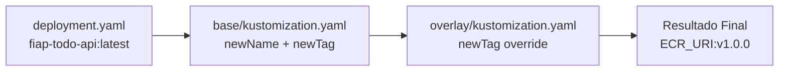

# 🎨 Guia: Como o Kustomize Substitui Imagens

## 📋 Processo Correto

### 1️⃣ Deployment Base (Placeholder)

**Arquivo: `k8s/base/deployment.yaml`**

```yaml
containers:
- name: fiap-todo-api
  image: fiap-todo-api:latest  # ← Placeholder genérico (não é a imagem real!)
```

**Por quê usar placeholder?**
- ✅ Mantém o manifesto genérico e reutilizável
- ✅ Não precisa alterar quando muda o ECR URI
- ✅ Funciona em qualquer ambiente (dev, staging, prod)

---

### 2️⃣ Kustomization Base (Substituição)

**Arquivo: `k8s/base/kustomization.yaml`**

```yaml
images:
- name: fiap-todo-api              # ← Deve corresponder ao placeholder
  newName: 777870534201.dkr.ecr.us-east-1.amazonaws.com/fiap-todo-api  # ← Imagem real
  newTag: latest                   # ← Tag (pode ser sobrescrita nos overlays)
```

**Como funciona:**
1. Kustomize procura `image: fiap-todo-api:latest` no deployment
2. Substitui por `newName:newTag`
3. Resultado: `777870534201.dkr.ecr.us-east-1.amazonaws.com/fiap-todo-api:latest`

---

### 3️⃣ Overlay Production (Customização Opcional)

**Arquivo: `k8s/overlays/production/kustomization.yaml`**

```yaml
bases:
- ../../base

# Sobrescrever apenas a tag (mantém newName da base)
images:
- name: fiap-todo-api
  newTag: v1.0.0  # ← Tag específica de produção
```

**Resultado final:**
```
777870534201.dkr.ecr.us-east-1.amazonaws.com/fiap-todo-api:v1.0.0
```

---

## 🔍 Fluxo Completo



---

## 📊 Comparação: Certo vs Errado

### ❌ ERRADO (Hard-coded)

```yaml
# deployment.yaml
image: 777870534201.dkr.ecr.us-east-1.amazonaws.com/fiap-todo-api:latest

# kustomization.yaml
images:
- name: 777870534201.dkr.ecr.us-east-1.amazonaws.com/fiap-todo-api
  newTag: v1.0.0
```

**Problemas:**
- ❌ Deployment não é reutilizável
- ❌ Precisa alterar deployment.yaml se mudar ECR
- ❌ Não funciona em múltiplos ambientes

---

### ✅ CORRETO (Placeholder + Substituição)

```yaml
# deployment.yaml
image: fiap-todo-api:latest

# base/kustomization.yaml
images:
- name: fiap-todo-api
  newName: 777870534201.dkr.ecr.us-east-1.amazonaws.com/fiap-todo-api
  newTag: latest

# overlays/production/kustomization.yaml
images:
- name: fiap-todo-api
  newTag: v1.0.0  # Sobrescreve apenas a tag
```

**Vantagens:**
- ✅ Deployment genérico e reutilizável
- ✅ Fácil trocar ECR (só altera kustomization.yaml)
- ✅ Cada overlay pode ter sua própria tag

---

## 🎯 Campos do Kustomize Images

| Campo | Descrição | Exemplo |
|-------|-----------|---------|
| `name` | Placeholder no deployment | `fiap-todo-api` |
| `newName` | URI completa da imagem | `777870534201.dkr.ecr.us-east-1.amazonaws.com/fiap-todo-api` |
| `newTag` | Tag da imagem | `latest`, `v1.0.0`, `sha-abc123` |

---

## 🔧 Comandos Úteis

```bash
# Ver resultado da substituição
kubectl kustomize k8s/overlays/production | grep -A5 "image:"

# Verificar se a imagem está correta
kubectl kustomize k8s/overlays/production | yq '.spec.template.spec.containers[0].image'

# Aplicar com dry-run
kubectl apply -k k8s/overlays/production --dry-run=client

# Aplicar de verdade
kubectl apply -k k8s/overlays/production
```

---

## 📝 Exemplo Completo: Múltiplos Ambientes

### Base (Genérico)
```yaml
# k8s/base/deployment.yaml
image: fiap-todo-api:latest

# k8s/base/kustomization.yaml
images:
- name: fiap-todo-api
  newName: 777870534201.dkr.ecr.us-east-1.amazonaws.com/fiap-todo-api
  newTag: latest
```

### Development
```yaml
# k8s/overlays/dev/kustomization.yaml
bases:
- ../../base

images:
- name: fiap-todo-api
  newTag: dev-latest  # Tag de desenvolvimento
```

### Staging
```yaml
# k8s/overlays/staging/kustomization.yaml
bases:
- ../../base

images:
- name: fiap-todo-api
  newTag: staging-v1.0.0  # Tag de staging
```

### Production
```yaml
# k8s/overlays/production/kustomization.yaml
bases:
- ../../base

images:
- name: fiap-todo-api
  newTag: v1.0.0  # Tag estável de produção
```

---

## 🚀 CI/CD: Substituição Dinâmica

**No GitHub Actions:**

```yaml
- name: Update Kustomize image
  run: |
    cd k8s/overlays/production
    kustomize edit set image fiap-todo-api=${{ env.ECR_URI }}:${{ github.sha }}
```

**Isso gera:**
```yaml
images:
- name: fiap-todo-api
  newName: 777870534201.dkr.ecr.us-east-1.amazonaws.com/fiap-todo-api
  newTag: abc123def456  # SHA do commit
```

---

## ✅ Checklist

Ao configurar imagens no Kustomize:

- [ ] Deployment usa placeholder genérico (`fiap-todo-api:latest`)
- [ ] Base kustomization tem `name` = placeholder
- [ ] Base kustomization tem `newName` = URI completa do ECR
- [ ] Base kustomization tem `newTag` = tag padrão
- [ ] Overlays sobrescrevem apenas `newTag` (não `newName`)
- [ ] Testado com `kubectl kustomize` antes de aplicar

---

## 🎓 Resumo

**Regra de Ouro:**
> Deployment = Placeholder genérico  
> Kustomization = Substituição real  
> Overlays = Customização por ambiente

**Você estava certo!** 🎯
- ✅ Deployment não deve ter URI hard-coded
- ✅ Kustomization faz a substituição
- ✅ Só precisa alterar kustomization.yaml quando muda ECR
