# 🎬 Vídeo 3.1 - Build e Publicação de Imagens Docker

**Aula**: 3 - Docker e Kubernetes  
**Vídeo**: 3.1  
**Temas**: Multi-stage build; ECR; OIDC; Pipeline Docker  

---

## 📚 Parte 1: Conceito AWS ECR

### Passo 1: O que é ECR?

**ECR - Elastic Container Registry:**

```mermaid
graph LR
    A[Docker Hub] -->|Público| B[Limitações]
    C[ECR AWS] -->|Privado| D[Ilimitado]
    C -->|Integrado| E[AWS Services]
```



**Vantagens do ECR:**
- ✅ Integração nativa com AWS
- ✅ Segurança (IAM, encryption)
- ✅ Scan de vulnerabilidades
- ✅ Sem limite de pull
- ✅ Lifecycle policies

---

## 🔧 Parte 2: Setup AWS

### Passo 2: Verificar Estrutura

```bash
# Ver estrutura do projeto
tree -L 2

# Estrutura:
# ├── app/              # Aplicação Todo API
# ├── Dockerfile        # Multi-stage build
# └── k8s/              # Manifests Kubernetes
```

### Passo 3: Criar ECR Repository

```bash
# Verificar credenciais AWS Learner Lab
aws sts get-caller-identity --profile fiapaws

# Criar repository ECR
aws ecr create-repository \
  --repository-name fiap-todo-api \
  --region us-east-1 \
  --profile fiapaws

# Salvar URI do repository
ECR_URI=$(aws ecr describe-repositories \
  --repository-names fiap-todo-api \
  --region us-east-1 \
  --profile fiapaws \
  --query 'repositories[0].repositoryUri' \
  --output text)

echo "ECR URI: $ECR_URI"
```

---

## Parte 3: Dockerfile Otimizado

### Passo 4: Arquitetura Multi-stage

```mermaid
graph TB
    subgraph "Stage 1: Builder"
        A[node:20-alpine] --> B[npm install --omit=dev]
        B --> C[node_modules produção]
        C --> D[Copiar src/]
        D --> E[Criar usuário nodejs]
    end
    
    subgraph "Stage 2: Runtime"
        F[node:20-alpine limpo] --> G[Copiar node_modules]
        G --> H[Copiar src/]
        H --> I[Copiar usuário]
        I --> J[USER nodejs]
        J --> K[Imagem Final Segura]
    end
    
    E --> G
    E --> H
    E --> I
```



### Passo 5: Ver Dockerfile Multi-stage

```bash
# Ver Dockerfile
cat Dockerfile
```

**Dockerfile:**
```dockerfile
# Stage 1: Builder
FROM node:20-alpine AS builder
WORKDIR /app

# Copiar package files
COPY app/package*.json ./

# Instalar dependências de produção
# npm install: instala e gera lock file se necessário
# --omit=dev: omite dependências de desenvolvimento
RUN npm install --omit=dev && npm cache clean --force

# Copiar código fonte
COPY app/src/ ./src/

# Criar usuário não-root
RUN addgroup -g 1001 -S nodejs && \
    adduser -S nodejs -u 1001

# Stage 2: Runtime
FROM node:20-alpine AS runtime
WORKDIR /app

# Copiar artefatos do builder
COPY --from=builder /app/node_modules ./node_modules
COPY --from=builder /app/package*.json ./
COPY --from=builder /app/src ./src

# Copiar usuário
COPY --from=builder /etc/passwd /etc/passwd
COPY --from=builder /etc/group /etc/group

# Mudar para usuário não-root
USER nodejs

EXPOSE 3000
HEALTHCHECK --interval=30s --timeout=3s --start-period=5s --retries=3 \
  CMD node -e "require('http').get('http://localhost:3000/health', (r) => {process.exit(r.statusCode === 200 ? 0 : 1)})"

CMD ["node", "src/server.js"]
```

### Passo 6: Build Local

```bash
# Build da imagem
docker build -t fiap-todo-api:local .

# Ver tamanho
docker images fiap-todo-api:local

# Rodar container
docker run -d --name todo-test -p 3000:3000 fiap-todo-api:local

# Testar endpoints
curl http://localhost:3000/health
curl http://localhost:3000/api/todos
curl http://localhost:3000/api/stats

# Limpar
docker stop todo-test && docker rm todo-test
```

---

## 🔐 Parte 4: Credenciais AWS para GitHub Actions

### Passo 7: Fluxo de Autenticação

```mermaid
sequenceDiagram
    participant GH as GitHub Actions
    participant Secrets as GitHub Secrets
    participant AWS as AWS
    participant ECR as AWS ECR
    
    GH->>Secrets: 1. Ler credenciais
    Secrets->>GH: 2. AWS_ACCESS_KEY_ID + SECRET
    GH->>AWS: 3. Autenticar
    AWS->>GH: 4. Sessão autenticada
    GH->>ECR: 5. Push image
    
    Note over GH,ECR: Credenciais seguras no GitHub Secrets
```



**⚠️ Importante - AWS Learner Lab:**
- Não podemos criar roles customizadas (sem OIDC)
- Usaremos AWS Access Keys do Learner Lab
- Credenciais armazenadas como GitHub Secrets

### Passo 8: Obter Credenciais AWS

```bash
# No AWS Learner Lab, clicar em "AWS Details"
# Copiar as credenciais:
# - aws_access_key_id
# - aws_secret_access_key
# - aws_session_token (se disponível)

# Verificar credenciais
aws sts get-caller-identity --profile fiapaws
```

### Passo 9: Configurar GitHub Secrets

**No GitHub Repository:**

1. Ir em **Settings** → **Secrets and variables** → **Actions**
2. Clicar em **New repository secret**
3. Adicionar os seguintes secrets:

```
Nome: AWS_ACCESS_KEY_ID
Valor: [copiar do AWS Details]

Nome: AWS_SECRET_ACCESS_KEY
Valor: [copiar do AWS Details]

Nome: AWS_SESSION_TOKEN (opcional, se disponível)
Valor: [copiar do AWS Details]

Nome: AWS_REGION
Valor: us-east-1
```

**🚨 Segurança:**
- Nunca commitar credenciais no código
- Usar apenas GitHub Secrets
- Renovar credenciais quando a sessão do Learner Lab expirar

---

## 🚀 Parte 5: Pipeline Docker

### Passo 10: Fluxo do Pipeline


### Passo 11: Criar Workflow (Faremos juntos na aula)

**Vamos criar o workflow durante a aula:**

```bash
# Criar diretório de workflows
mkdir -p .github/workflows

# Criar arquivo do workflow
cat > .github/workflows/docker-build.yml << 'EOF'
name: 🐳 Docker Build and Push

on:
  push:
    branches: [ main ]
    paths: [ 'app/**', 'Dockerfile' ]
  workflow_dispatch:

env:
  AWS_REGION: us-east-1
  ECR_REPOSITORY: fiap-todo-api

jobs:
  build-and-push:
    name: 🐳 Build and Push to ECR
    runs-on: ubuntu-latest
    
    steps:
      - name: 📥 Checkout código
        uses: actions/checkout@v4
      
      - name: 🔧 Setup Docker Buildx
        uses: docker/setup-buildx-action@v3
      
      - name: 🔑 Configure AWS credentials
        uses: aws-actions/configure-aws-credentials@v4
        with:
          aws-access-key-id: ${{ secrets.AWS_ACCESS_KEY_ID }}
          aws-secret-access-key: ${{ secrets.AWS_SECRET_ACCESS_KEY }}
          aws-session-token: ${{ secrets.AWS_SESSION_TOKEN }}
          aws-region: ${{ env.AWS_REGION }}
      
      - name: 🔑 Login to Amazon ECR
        id: login-ecr
        uses: aws-actions/amazon-ecr-login@v2
      
      - name: 🏷️ Generate image tags
        id: meta
        run: |
          echo "tags<<EOF" >> $GITHUB_OUTPUT
          echo "${{ steps.login-ecr.outputs.registry }}/${{ env.ECR_REPOSITORY }}:latest" >> $GITHUB_OUTPUT
          echo "${{ steps.login-ecr.outputs.registry }}/${{ env.ECR_REPOSITORY }}:${{ github.sha }}" >> $GITHUB_OUTPUT
          echo "${{ steps.login-ecr.outputs.registry }}/${{ env.ECR_REPOSITORY }}:v1.${{ github.run_number }}" >> $GITHUB_OUTPUT
          echo "EOF" >> $GITHUB_OUTPUT
      
      - name: 🐳 Build and push
        uses: docker/build-push-action@v5
        with:
          context: .
          push: true
          tags: ${{ steps.meta.outputs.tags }}
          cache-from: type=gha
          cache-to: type=gha,mode=max
          platforms: linux/amd64
      
      - name: 🔍 Scan image
        run: |
          aws ecr start-image-scan \
            --repository-name ${{ env.ECR_REPOSITORY }} \
            --image-id imageTag=latest \
            --region ${{ env.AWS_REGION }}
      
      - name: 📊 Summary
        run: |
          echo "## 🐳 Docker Build Summary" >> $GITHUB_STEP_SUMMARY
          echo "" >> $GITHUB_STEP_SUMMARY
          echo "**Repository**: ${{ env.ECR_REPOSITORY }}" >> $GITHUB_STEP_SUMMARY
          echo "**Tags**:" >> $GITHUB_STEP_SUMMARY
          echo "- \`latest\`" >> $GITHUB_STEP_SUMMARY
          echo "- \`${{ github.sha }}\`" >> $GITHUB_STEP_SUMMARY
          echo "- \`v1.${{ github.run_number }}\`" >> $GITHUB_STEP_SUMMARY
EOF
```

**Explicação do workflow:**
- ✅ **Trigger**: Push em `main` ou manual (`workflow_dispatch`)
- ✅ **Paths**: Só executa se mudar `app/` ou `Dockerfile`
- ✅ **Tags**: Gera 3 tags (latest, SHA, versão)
- ✅ **Cache**: Usa GitHub Actions cache para acelerar builds
- ✅ **Scan**: Escaneia vulnerabilidades no ECR
- ✅ **Summary**: Mostra resumo no GitHub Actions

---

## 🧪 Parte 6: Testar Pipeline

### Passo 12: Verificar Secrets

**Verificar se os secrets foram configurados:**
- ✅ `AWS_ACCESS_KEY_ID`
- ✅ `AWS_SECRET_ACCESS_KEY`
- ✅ `AWS_SESSION_TOKEN` (opcional)
- ✅ `AWS_REGION`

### Passo 13: Commit e Push

```bash
# Adicionar workflow que criamos
git add .github/workflows/docker-build.yml

# Commit
git commit -m "feat: adicionar pipeline Docker com ECR"
git push origin main

# Ver no GitHub Actions
# ✅ Build and Push to ECR
```

### Passo 14: Verificar no ECR

```bash
# Listar imagens
aws ecr list-images \
  --repository-name fiap-todo-api \
  --region us-east-1 \
  --profile fiapaws

# Ver detalhes
aws ecr describe-images \
  --repository-name fiap-todo-api \
  --region us-east-1 \
  --profile fiapaws
```

---

## 🔍 Parte 7: Scan de Vulnerabilidades

### Passo 15: Ver Resultados do Scan

```bash
# Aguardar scan completar (1-2 min)
sleep 120

# Ver resultados
aws ecr describe-image-scan-findings \
  --repository-name fiap-todo-api \
  --image-id imageTag=latest \
  --region us-east-1 \
  --profile fiapaws
```

### Passo 16: Configurar Scan Automático

```bash
# Habilitar scan automático
aws ecr put-image-scanning-configuration \
  --repository-name fiap-todo-api \
  --image-scanning-configuration scanOnPush=true \
  --region us-east-1 \
  --profile fiapaws
```

---

## 🎓 Parte 8: Conceitos Aprendidos

### Passo 17: Fluxo Completo


**O que aprendemos:**
- ✅ Dockerfile multi-stage otimizado
- ✅ AWS ECR como registry privado
- ✅ GitHub Secrets para credenciais AWS (Learner Lab)
- ✅ Pipeline Docker automatizado
- ✅ Multiple tags (latest, sha, version)
- ✅ Scan de vulnerabilidades
- ✅ Cache de layers

---

**FIM DO VÍDEO 3.1** ✅
