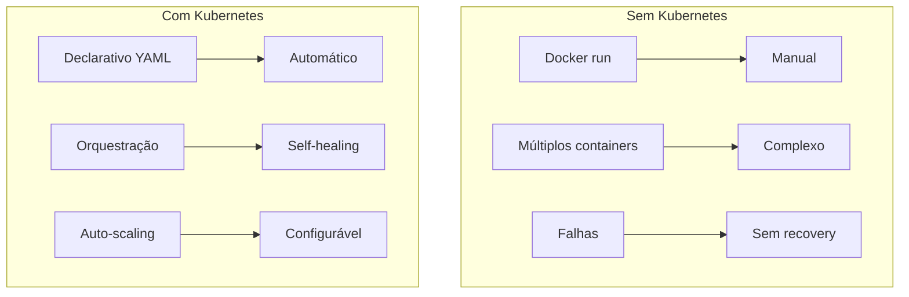
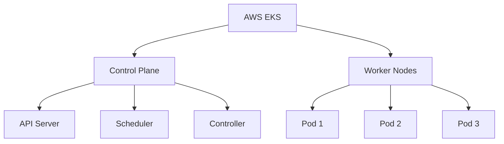
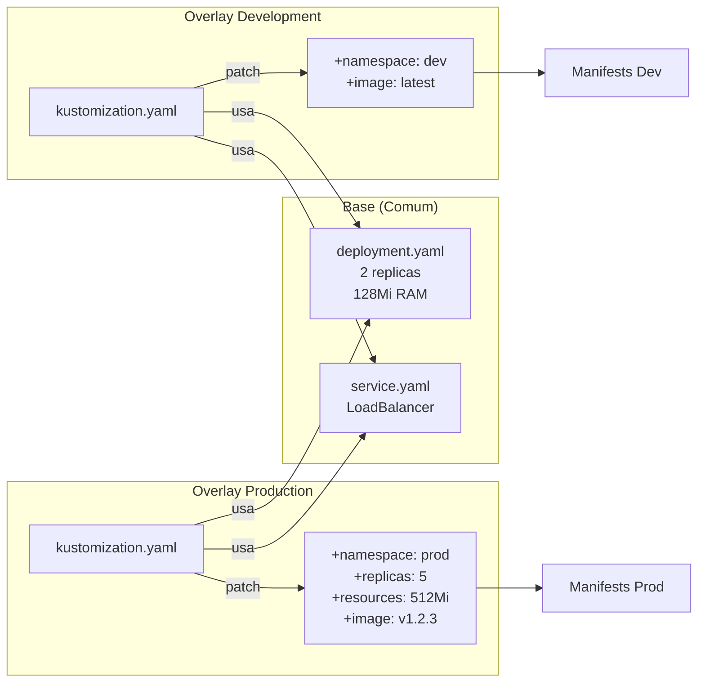
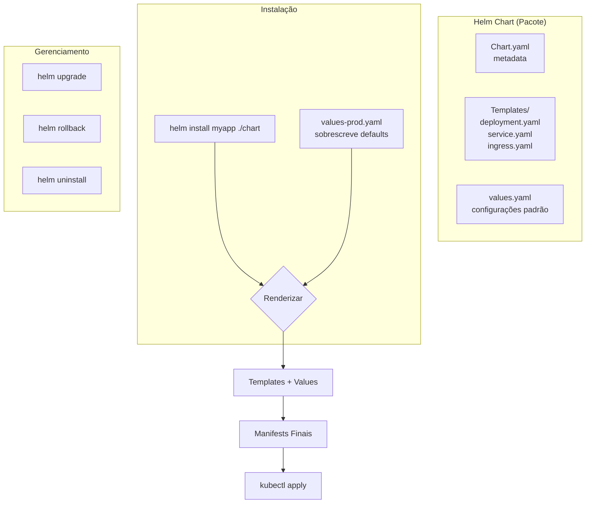
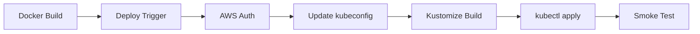
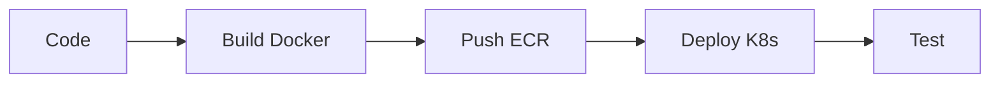

# 🎬 Vídeo 3.2 - Deploy com Automação de Manifestos

**Aula**: 3 - Docker e Kubernetes  
**Vídeo**: 3.2  
**Temas**: EKS; Kustomize; Helm; Manifests; Overlays  

---

## 📚 Parte 1: Conceito Kubernetes

### Passo 1: Por que Kubernetes?



---

## ☘️ Parte 2: Criar Cluster EKS

### Passo 2: Arquitetura EKS



### Passo 3: Verificar Pré-requisitos

```bash
# Verificar AWS CLI
aws --version

# Verificar credenciais
aws sts get-caller-identity --profile fiapaws

# Verificar kubectl
kubectl version --client
```

### Passo 4: Configurar Variáveis de Ambiente

```bash
# Definir região (us-east-1 ou us-west-2)
export AWS_REGION=us-east-1
# ou
# export AWS_REGION=us-west-2

# Verificar região configurada
echo "Região selecionada: $AWS_REGION"

# Obter Account ID
export AWS_ACCOUNT_ID=$(aws sts get-caller-identity --profile fiapaws --query Account --output text)
echo "Account ID: $AWS_ACCOUNT_ID"
```

### Passo 5: Discovery de Subnets

```bash
# Listar todas as subnets públicas disponíveis na região
echo "🔍 Descobrindo subnets públicas na região $AWS_REGION..."

aws ec2 describe-subnets \
  --profile fiapaws \
  --region $AWS_REGION \
  --filters "Name=map-public-ip-on-launch,Values=true" \
  --query 'Subnets[*].[SubnetId,AvailabilityZone,CidrBlock]' \
  --output table

# Obter IDs das subnets públicas (mínimo 2 para EKS)
export SUBNET_IDS=$(aws ec2 describe-subnets \
  --profile fiapaws \
  --region $AWS_REGION \
  --filters "Name=map-public-ip-on-launch,Values=true" \
  --query 'Subnets[*].SubnetId' \
  --output text)

echo "Subnets encontradas: $SUBNET_IDS"

# Contar subnets
SUBNET_COUNT=$(echo $SUBNET_IDS | wc -w | tr -d ' ')
echo "Total de subnets públicas: $SUBNET_COUNT"

# Validar (EKS precisa de no mínimo 2 subnets)
if [ $SUBNET_COUNT -lt 2 ]; then
  echo "❌ ERRO: EKS requer no mínimo 2 subnets. Encontradas: $SUBNET_COUNT"
  exit 1
else
  echo "✅ Subnets suficientes para criar cluster EKS"
fi
```

### Passo 6: Criar Cluster EKS

```bash
# Criar cluster EKS (AWS Learner Lab compatible)
echo "🚀 Criando cluster EKS na região $AWS_REGION..."

aws eks create-cluster \
  --name cicd-lab \
  --region $AWS_REGION \
  --role-arn arn:aws:iam::${AWS_ACCOUNT_ID}:role/LabRole \
  --resources-vpc-config subnetIds=$(echo $SUBNET_IDS | tr ' ' ',') \
  --profile fiapaws

# Aguardar cluster ativo (15-20 min)
echo "⏳ Aguardando cluster ficar ativo (15-20 minutos)..."
aws eks wait cluster-active \
  --name cicd-lab \
  --region $AWS_REGION \
  --profile fiapaws

echo "✅ Cluster ativo!"
```

### Passo 7: Criar Node Group

```bash
# Criar node group
echo "🚀 Criando node group..."

aws eks create-nodegroup \
  --cluster-name cicd-lab \
  --nodegroup-name workers \
  --node-role arn:aws:iam::${AWS_ACCOUNT_ID}:role/LabRole \
  --subnets $(echo $SUBNET_IDS | tr ' ' ',') \
  --instance-types t3.medium \
  --scaling-config minSize=2,maxSize=2,desiredSize=2 \
  --region $AWS_REGION \
  --profile fiapaws

# Aguardar node group ativo
echo "⏳ Aguardando node group ficar ativo..."
aws eks wait nodegroup-active \
  --cluster-name cicd-lab \
  --nodegroup-name workers \
  --region $AWS_REGION \
  --profile fiapaws

echo "✅ Node group ativo!"
```

### Passo 8: Configurar kubectl

```bash
# Configurar acesso ao cluster
aws eks update-kubeconfig \
  --name cicd-lab \
  --region $AWS_REGION \
  --profile fiapaws

# Verificar nodes
kubectl get nodes

# Ver informações detalhadas
kubectl get nodes -o wide
```

---

## 📦 Parte 3: Manifests Kubernetes

### Passo 9: Ver Estrutura de Manifests

```bash
# Ver estrutura
tree k8s/

# Estrutura:
# k8s/
# ├── base/
# │   ├── deployment.yaml
# │   ├── service.yaml
# │   └── kustomization.yaml
# └── overlays/
#     ├── development/
#     └── production/
```

### Passo 10: Ver Deployment

```bash
# Ver deployment base
cat k8s/base/deployment.yaml
```

**deployment.yaml:**
```yaml
apiVersion: apps/v1
kind: Deployment
metadata:
  name: fiap-todo-api
  labels:
    app: fiap-todo-api
spec:
  replicas: 2
  selector:
    matchLabels:
      app: fiap-todo-api
  template:
    metadata:
      labels:
        app: fiap-todo-api
    spec:
      containers:
      - name: api
        image: YOUR_ECR_URI/fiap-todo-api:latest
        ports:
        - containerPort: 3000
        env:
        - name: NODE_ENV
          value: "production"
        resources:
          requests:
            memory: "128Mi"
            cpu: "100m"
          limits:
            memory: "256Mi"
            cpu: "200m"
        livenessProbe:
          httpGet:
            path: /health
            port: 3000
          initialDelaySeconds: 30
          periodSeconds: 10
        readinessProbe:
          httpGet:
            path: /health
            port: 3000
          initialDelaySeconds: 5
          periodSeconds: 5
```

### Passo 11: Ver Service

```bash
# Ver service
cat k8s/base/service.yaml
```

**service.yaml:**
```yaml
apiVersion: v1
kind: Service
metadata:
  name: fiap-todo-api
  labels:
    app: fiap-todo-api
spec:
  type: LoadBalancer
  ports:
  - port: 80
    targetPort: 3000
    protocol: TCP
  selector:
    app: fiap-todo-api
```

---

## 🎨 Parte 4: Kustomize

### Passo 12: Conceito Kustomize

**Problema**: Mesma aplicação, configurações diferentes por ambiente (dev, staging, prod)

**Solução Ruim**: Duplicar YAMLs para cada ambiente ❌
**Solução Kustomize**: Base + Overlays (patches) ✅



**Vantagens**:
- ✅ DRY (Don't Repeat Yourself) - base compartilhada
- ✅ Patches específicos por ambiente
- ✅ Sem templates complexos
- ✅ Nativo do Kubernetes

### Passo 13: Ver Kustomization Base

```bash
# Ver kustomization base
cat k8s/base/kustomization.yaml
```

**kustomization.yaml:**
```yaml
apiVersion: kustomize.config.k8s.io/v1beta1
kind: Kustomization

resources:
  - deployment.yaml
  - service.yaml

commonLabels:
  app: fiap-todo-api
  managed-by: kustomize
```

### Passo 14: Criar Overlay Production

```bash
# Ver overlay production
cat k8s/overlays/production/kustomization.yaml
```

**overlays/production/kustomization.yaml:**
```yaml
apiVersion: kustomize.config.k8s.io/v1beta1
kind: Kustomization

bases:
  - ../../base

namePrefix: prod-

replicas:
  - name: fiap-todo-api
    count: 3

images:
  - name: YOUR_ECR_URI/fiap-todo-api
    newTag: latest

patchesStrategicMerge:
  - deployment-patch.yaml
```

**deployment-patch.yaml:**
```yaml
apiVersion: apps/v1
kind: Deployment
metadata:
  name: fiap-todo-api
spec:
  template:
    spec:
      containers:
      - name: api
        resources:
          requests:
            memory: "256Mi"
            cpu: "200m"
          limits:
            memory: "512Mi"
            cpu: "500m"
```

### Passo 15: Build e Deploy com Kustomize

```bash
# Build manifests
kubectl kustomize k8s/overlays/production

# Aplicar no cluster
kubectl apply -k k8s/overlays/production

# Verificar deployment
kubectl get deployments
kubectl get pods
kubectl get services

# Ver logs
kubectl logs -l app=fiap-todo-api --tail=50
```

---

## ⚓ Parte 5: Helm

### Passo 16: Conceito Helm

**Helm = Package Manager do Kubernetes** (como apt, yum, npm)

**Problema**: Instalar aplicações complexas com múltiplos recursos
**Solução**: Helm Charts (pacotes reutilizáveis)



**Helm vs Kustomize**:
- **Kustomize**: Patches em YAMLs existentes (mais simples)
- **Helm**: Templates com variáveis (mais poderoso, reutilizável)

**Quando usar Helm?**
- ✅ Distribuir aplicações para terceiros
- ✅ Aplicações complexas com muitas configurações
- ✅ Versionamento e rollback de releases
- ✅ Repositórios de charts (Helm Hub)

### Passo 17: Criar Helm Chart

```bash
# Criar chart
helm create fiap-todo-chart

# Estrutura:
# fiap-todo-chart/
# ├── Chart.yaml
# ├── values.yaml
# └── templates/
#     ├── deployment.yaml
#     ├── service.yaml
#     └── ingress.yaml
```

### Passo 18: Configurar values.yaml

```bash
# Editar values
cat > fiap-todo-chart/values.yaml << 'EOF'
replicaCount: 2

image:
  repository: YOUR_ECR_URI/fiap-todo-api
  pullPolicy: IfNotPresent
  tag: "latest"

service:
  type: LoadBalancer
  port: 80
  targetPort: 3000

resources:
  limits:
    cpu: 200m
    memory: 256Mi
  requests:
    cpu: 100m
    memory: 128Mi

autoscaling:
  enabled: false
  minReplicas: 2
  maxReplicas: 10
  targetCPUUtilizationPercentage: 80

env:
  - name: NODE_ENV
    value: "production"
EOF
```

### Passo 19: Deploy com Helm

```bash
# Install chart
helm install fiap-todo fiap-todo-chart \
  --namespace default \
  --create-namespace

# Verificar release
helm list

# Ver status
helm status fiap-todo

# Upgrade
helm upgrade fiap-todo fiap-todo-chart \
  --set replicaCount=3

# Rollback se necessário
helm rollback fiap-todo 1
```

---

## 🚀 Parte 6: Pipeline de Deploy

### Passo 20: Fluxo do Pipeline



### Passo 21: Criar Workflow de Deploy (Faremos juntos na aula)

**Workflow que criaremos:**
```yaml
name: ☸️ Deploy to Kubernetes

on:
  workflow_run:
    workflows: ["🐳 Docker Build and Push"]
    types: [completed]
    branches: [main]
  workflow_dispatch:

env:
  AWS_REGION: us-east-1
  CLUSTER_NAME: cicd-lab

jobs:
  deploy:
    name: 🚀 Deploy to EKS
    runs-on: ubuntu-latest
    if: ${{ github.event.workflow_run.conclusion == 'success' }}
    
    permissions:
      id-token: write
      contents: read
    
    steps:
      - name: 📥 Checkout código
        uses: actions/checkout@v4
      
      - name: 🔑 Configure AWS credentials
        uses: aws-actions/configure-aws-credentials@v4
        with:
          aws-access-key-id: ${{ secrets.AWS_ACCESS_KEY_ID }}
          aws-secret-access-key: ${{ secrets.AWS_SECRET_ACCESS_KEY }}
          aws-session-token: ${{ secrets.AWS_SESSION_TOKEN }}
          aws-region: ${{ env.AWS_REGION }}
      
      - name: ☘️ Update kubeconfig
        run: |
          aws eks update-kubeconfig \
            --name ${{ env.CLUSTER_NAME }} \
            --region ${{ env.AWS_REGION }} \
            --profile fiapaws
      
      - name: 🔧 Setup Kustomize
        run: |
          curl -s "https://raw.githubusercontent.com/kubernetes-sigs/kustomize/master/hack/install_kustomize.sh" | bash
          sudo mv kustomize /usr/local/bin/
      
      - name: 📝 Update image tag
        working-directory: k8s/overlays/production
        run: |
          kustomize edit set image \
            ${{ secrets.ECR_URI }}/fiap-todo-api:${{ github.sha }}
      
      - name: 🚀 Deploy to Kubernetes
        run: |
          kubectl apply -k k8s/overlays/production
          kubectl rollout status deployment/prod-fiap-todo-api
      
      - name: 🧪 Smoke test
        run: |
          # Aguardar service estar pronto
          sleep 30
          
          # Obter LoadBalancer URL
          LB_URL=$(kubectl get service prod-fiap-todo-api \
            -o jsonpath='{.status.loadBalancer.ingress[0].hostname}')
          
          echo "Testing: http://$LB_URL/health"
          curl -f http://$LB_URL/health || exit 1
          
          echo "✅ Smoke test passed!"
      
      - name: 📊 Deployment summary
        run: |
          echo "## ☸️ Kubernetes Deployment" >> $GITHUB_STEP_SUMMARY
          echo "" >> $GITHUB_STEP_SUMMARY
          echo "**Cluster**: ${{ env.CLUSTER_NAME }}" >> $GITHUB_STEP_SUMMARY
          echo "**Image**: \`${{ github.sha }}\`" >> $GITHUB_STEP_SUMMARY
          echo "" >> $GITHUB_STEP_SUMMARY
          echo "### Pods:" >> $GITHUB_STEP_SUMMARY
          echo '```' >> $GITHUB_STEP_SUMMARY
          kubectl get pods -l app=fiap-todo-api >> $GITHUB_STEP_SUMMARY
          echo '```' >> $GITHUB_STEP_SUMMARY
```

---

## 🧪 Parte 7: Testar Deploy

### Passo 22: Trigger Deploy

```bash
# Fazer mudança na aplicação
echo "// Deploy test" >> app/src/app.js

# Commit e push
git add .
git commit -m "feat: trigger deploy to kubernetes"
git push origin main

# Ver no GitHub Actions:
# 1. Docker Build and Push (completa)
# 2. Deploy to Kubernetes (inicia automaticamente)
```

### Passo 23: Verificar Deploy

```bash
# Ver pods
kubectl get pods -l app=fiap-todo-api

# Ver service
kubectl get service prod-fiap-todo-api

# Obter URL do LoadBalancer
LB_URL=$(kubectl get service prod-fiap-todo-api \
  -o jsonpath='{.status.loadBalancer.ingress[0].hostname}')

echo "API URL: http://$LB_URL"

# Testar API
curl http://$LB_URL/health
curl http://$LB_URL/api/todos
curl http://$LB_URL/api/stats

# Criar novo todo
curl -X POST http://$LB_URL/api/todos \
  -H "Content-Type: application/json" \
  -d '{"title":"Deploy K8s na FIAP","priority":"high","category":"education"}'
```

---

## 🎓 Parte 8: Conceitos Aprendidos

### Passo 24: Fluxo Completo



**O que aprendemos:**
- ✅ Criar cluster EKS com AWS CLI (AWS Learner Lab)
- ✅ Manifests Kubernetes (Deployment, Service)
- ✅ Kustomize para múltiplos ambientes
- ✅ Helm charts para templating
- ✅ Pipeline de deploy automatizado
- ✅ Smoke tests pós-deploy
- ✅ LoadBalancer para acesso externo

---

**FIM DO VÍDEO 3.2** ✅
