# 🎬 Vídeo 3.2 - Deploy com Automação de Manifestos

**Aula**: 3 - Docker e Kubernetes  
**Vídeo**: 3.2  
**Temas**: EKS; Kustomize; Helm; Manifests; Overlays  

---

## 📚 Parte 1: Conceito Kubernetes

### Passo 1: Por que Kubernetes?

```mermaid
graph TB
    subgraph "Sem Kubernetes"
        A1[Docker run] --> A2[Manual]
        A3[Múltiplos containers] --> A4[Complexo]
        A5[Falhas] --> A6[Sem recovery]
    end
    
    subgraph "Com Kubernetes"
        B1[Declarativo YAML] --> B2[Automático]
        B3[Orquestração] --> B4[Self-healing]
        B5[Auto-scaling] --> B6[Configurável]
    end
```



---

## ☘️ Parte 2: Configurar Acesso ao Cluster EKS

**⚠️ Pré-requisito: Cluster EKS da Aula 01**

Este vídeo assume que você já tem o cluster `cicd-lab` criado na **Aula 01**.

📂 Repositório: [fiap-dclt-aula01](https://github.com/josenetoo/fiap-dclt-aula01)

### Passo 2: Verificar Cluster Existente

```bash
# Verificar se cluster existe
aws eks list-clusters --region us-east-1 --profile fiapaws

# Verificar status do cluster
aws eks describe-cluster \
  --name cicd-lab \
  --region us-east-1 \
  --profile fiapaws \
  --query 'cluster.status'
```

### Passo 3: Configurar kubectl

```bash
# Configurar acesso ao cluster
aws eks update-kubeconfig \
  --name cicd-lab \
  --region us-east-1 \
  --profile fiapaws

# Verificar nodes
kubectl get nodes

# Ver informações detalhadas
kubectl get nodes -o wide
```

---

## 📦 Parte 3: Manifests Kubernetes

### Passo 4: Ver Estrutura de Manifests

```bash
# Ver estrutura
tree k8s/

# Estrutura:
# k8s/
# ├── base/
# │   ├── deployment.yaml
# │   ├── service.yaml
# │   └── kustomization.yaml
# └── overlays/
#     └── production/
```

### Passo 5: Ver Deployment

```bash
# Ver deployment base
cat k8s/base/deployment.yaml
```

### Passo 6: Ver Service

```bash
# Ver service
cat k8s/base/service.yaml
```

---

## 🎨 Parte 4: Kustomize

### Passo 7: Conceito Kustomize

**Kustomize = Customização Nativa do Kubernetes** (sem templates)

**Problema**: Mesma aplicação, configurações diferentes por ambiente (dev, staging, prod)
**Solução**: Base + Overlays (patches)

```mermaid
graph TB
    subgraph "Kustomize (Estrutura)"
        A[base/<br/>deployment.yaml<br/>service.yaml<br/>kustomization.yaml]
        B[overlays/<br/>development/<br/>production/]
    end
    
    subgraph "Como Funciona"
        C[kubectl apply -k overlays/production] --> D{Kustomize}
        A --> D
        B --> D
    end
    
    D --> E[Base + Patches]
    E --> F[Manifests Finais]
    F --> G[kubectl apply]
    
    subgraph "Customizações"
        H[namePrefix/Suffix]
        I[replicas]
        J[images]
        K[patches]
    end
```



**Kustomize vs Helm**:
- **Kustomize**: Patches em YAMLs existentes (mais simples, nativo)
- **Helm**: Templates com variáveis (mais poderoso, reutilizável)

**Quando usar Kustomize?**
- ✅ Múltiplos ambientes (dev, staging, prod)
- ✅ Customizações simples (replicas, images, labels)
- ✅ Sem necessidade de templates complexos
- ✅ Já vem integrado com kubectl (`kubectl apply -k`)

### Passo 8: Ver Kustomization Base

```bash
# Ver kustomization base
cat k8s/base/kustomization.yaml
```

### Passo 9: Ver Overlay Production

```bash
# Ver overlay production
cat k8s/overlays/production/kustomization.yaml

# Ver patch de deployment
cat k8s/overlays/production/deployment-patch.yaml
```

### Passo 10: Build e Deploy com Kustomize

```bash
# Build manifests
kubectl kustomize k8s/overlays/production

# Aplicar no cluster
kubectl apply -k k8s/overlays/production

# Verificar deployment
kubectl get deployments
kubectl get pods
kubectl get services

# Ver logs
kubectl logs -l app=fiap-todo-api --tail=50
```

---

## ⚓ Parte 5: Helm

### Passo 11: Conceito Helm

**Helm = Package Manager do Kubernetes** (como apt, yum, npm)

**Problema**: Instalar aplicações complexas com múltiplos recursos
**Solução**: Helm Charts (pacotes reutilizáveis)

```mermaid
graph TB
    subgraph "Helm Chart (Pacote)"
        A[Chart.yaml<br/>metadata]
        B[Templates/<br/>deployment.yaml<br/>service.yaml<br/>ingress.yaml]
        C[values.yaml<br/>configurações padrão]
    end
    
    subgraph "Instalação"
        D[helm install myapp ./chart] --> E{Renderizar}
        F[values-prod.yaml<br/>sobrescreve defaults] --> E
    end
    
    E --> G[Templates + Values]
    G --> H[Manifests Finais]
    H --> I[kubectl apply]
    
    subgraph "Gerenciamento"
        J[helm upgrade]
        K[helm rollback]
        L[helm uninstall]
    end
```



**Helm vs Kustomize**:
- **Kustomize**: Patches em YAMLs existentes (mais simples)
- **Helm**: Templates com variáveis (mais poderoso, reutilizável)

**Quando usar Helm?**
- ✅ Distribuir aplicações para terceiros
- ✅ Aplicações complexas com muitas configurações
- ✅ Versionamento e rollback de releases
- ✅ Repositórios de charts (Helm Hub)

### Passo 12: Criar Helm Chart

```bash
# Criar chart
helm create fiap-todo-chart

# Estrutura:
# fiap-todo-chart/
# ├── Chart.yaml
# ├── values.yaml
# └── templates/
#     ├── deployment.yaml
#     ├── service.yaml
#     └── ingress.yaml
```

### Passo 13: Configurar values.yaml

**O `helm create` gera um values.yaml completo. Vamos customizar apenas o necessário:**

```bash
# Editar values (manter estrutura do helm create, customizar valores)
cat > fiap-todo-chart/values.yaml << 'EOF'
replicaCount: 2

image:
  repository: YOUR_ECR_URI/fiap-todo-api
  pullPolicy: IfNotPresent
  tag: "latest"

imagePullSecrets: []
nameOverride: ""
fullnameOverride: ""

serviceAccount:
  create: true
  annotations: {}
  name: ""

podAnnotations: {}
podLabels: {}

podSecurityContext: {}
securityContext: {}

service:
  type: LoadBalancer
  port: 80
  targetPort: 3000

ingress:
  enabled: false
  className: ""
  annotations: {}
  hosts:
    - host: chart-example.local
      paths:
        - path: /
          pathType: ImplementationSpecific
  tls: []

httpRoute:
  enabled: false

resources:
  limits:
    cpu: 200m
    memory: 256Mi
  requests:
    cpu: 100m
    memory: 128Mi

livenessProbe:
  httpGet:
    path: /health
    port: 3000
  initialDelaySeconds: 30
  periodSeconds: 10

readinessProbe:
  httpGet:
    path: /health
    port: 3000
  initialDelaySeconds: 5
  periodSeconds: 5

autoscaling:
  enabled: false
  minReplicas: 2
  maxReplicas: 10
  targetCPUUtilizationPercentage: 80

volumes: []
volumeMounts: []

nodeSelector: {}
tolerations: []
affinity: {}

env:
  - name: NODE_ENV
    value: "production"
  - name: PORT
    value: "3000"
EOF
```

**⚠️ Importante:**
- O `helm create` gera templates que esperam esses valores
- Se faltar algum campo, você terá erro de "nil pointer"
- Campos vazios (`{}` ou `[]`) são válidos e desabilitam a funcionalidade

### Passo 14: Deploy com Helm

```bash
# Install chart
helm install fiap-todo fiap-todo-chart \
  --namespace default \
  --create-namespace

# Verificar release
helm list

# Ver status
helm status fiap-todo

# Upgrade
helm upgrade fiap-todo fiap-todo-chart \
  --set replicaCount=3

# Rollback se necessário
helm rollback fiap-todo 1
```

---

## 🚀 Parte 6: Pipeline de Deploy

### Passo 15: Configurar Secrets do GitHub

**Antes de criar o workflow, precisamos adicionar os secrets necessários:**

**No GitHub:**
1. Vá para: `Settings` → `Secrets and variables` → `Actions`
2. Clique em `New repository secret`

**Secrets necessários:**

| Secret | Valor | Onde Obter |
|--------|-------|------------|
| `AWS_ACCESS_KEY_ID` | `AKIA...` | AWS Learner Lab → AWS Details |
| `AWS_SECRET_ACCESS_KEY` | `wJalr...` | AWS Learner Lab → AWS Details |
| `AWS_SESSION_TOKEN` | `IQoJb3...` | AWS Learner Lab → AWS Details |
| `ECR_URI` | `777870534201.dkr.ecr.us-east-1.amazonaws.com` | Output do ECR |

**⚠️ Nota sobre CLUSTER_NAME:**
- O `CLUSTER_NAME` está **hard-coded** no workflow como `cicd-lab`
- Se seu cluster tiver outro nome, altere no workflow
- Não precisa ser secret (não é sensível)

**Comandos para obter valores:**

```bash
# Ver ECR URI
aws ecr describe-repositories \
  --repository-names fiap-todo-api \
  --region us-east-1 \
  --query 'repositories[0].repositoryUri' \
  --output text

# Ver nome do cluster
aws eks list-clusters --region us-east-1

# Obter credenciais do Learner Lab
# Copie de: AWS Details → Show → AWS CLI credentials
```

---

### Passo 16: Fluxo do Pipeline


### Passo 17: Criar Workflow de Deploy (Faremos juntos na aula)

**Vamos criar o workflow durante a aula:**

**Linux/Mac:**
```bash
# Criar arquivo do workflow
cat > .github/workflows/k8s-deploy.yml << 'EOF'
name: ☸️ Deploy to Kubernetes

on:
  workflow_run:
    workflows: ["🐳 Docker Build and Push"]
    types: [completed]
    branches: [main]
  workflow_dispatch:

env:
  AWS_REGION: us-east-1
  CLUSTER_NAME: cicd-lab

jobs:
  deploy:
    name: 🚀 Deploy to EKS
    runs-on: ubuntu-latest
    if: ${{ github.event.workflow_run.conclusion == 'success' }}
    
    permissions:
      id-token: write
      contents: read
    
    steps:
      - name: 📥 Checkout código
        uses: actions/checkout@v4
      
      - name: 🔑 Configure AWS credentials
        uses: aws-actions/configure-aws-credentials@v4
        with:
          aws-access-key-id: ${{ secrets.AWS_ACCESS_KEY_ID }}
          aws-secret-access-key: ${{ secrets.AWS_SECRET_ACCESS_KEY }}
          aws-session-token: ${{ secrets.AWS_SESSION_TOKEN }}
          aws-region: ${{ env.AWS_REGION }}
      
      - name: ☘️ Update kubeconfig
        run: |
          aws eks update-kubeconfig \
            --name ${{ env.CLUSTER_NAME }} \
            --region ${{ env.AWS_REGION }}
      
      - name: 🔧 Setup Kustomize
        run: |
          curl -s "https://raw.githubusercontent.com/kubernetes-sigs/kustomize/master/hack/install_kustomize.sh" | bash
          sudo mv kustomize /usr/local/bin/
      
      - name: 📝 Update image tag
        working-directory: k8s/overlays/production
        run: |
          kustomize edit set image \
            ${{ secrets.ECR_URI }}/fiap-todo-api:${{ github.sha }}
      
      - name: 🚀 Deploy to Kubernetes
        run: |
          kubectl apply -k k8s/overlays/production
          kubectl rollout status deployment/prod-fiap-todo-api
      
      - name: 🧪 Smoke test
        continue-on-error: true
        run: |
          echo "⏳ Aguardando LoadBalancer estar pronto..."
          
          # Aguardar até 2 minutos para LoadBalancer ter hostname
          for i in {1..12}; do
            LB_URL=$(kubectl get service prod-fiap-todo-api-service \
              -o jsonpath='{.status.loadBalancer.ingress[0].hostname}')
            
            if [ -n "$LB_URL" ]; then
              echo "✅ LoadBalancer pronto: $LB_URL"
              break
            fi
            
            echo "⏳ Tentativa $i/12 - Aguardando LoadBalancer..."
            sleep 10
          done
          
          # Verificar se obteve URL
          if [ -z "$LB_URL" ]; then
            echo "⚠️ LoadBalancer ainda não está pronto (pode demorar até 5 minutos)"
            echo "✅ Deploy concluído! Verifique manualmente: kubectl get service prod-fiap-todo-api-service"
            exit 0
          fi
          
          # Aguardar LoadBalancer estar acessível
          echo "⏳ Aguardando LoadBalancer estar acessível..."
          sleep 20
          
          # Testar health endpoint
          echo "🧪 Testando: http://$LB_URL/health"
          if curl -f --max-time 10 http://$LB_URL/health; then
            echo "✅ Smoke test passed!"
          else
            echo "⚠️ Health check falhou, mas LoadBalancer está provisionando"
            echo "✅ Verifique em alguns minutos: http://$LB_URL/health"
          fi
      
      - name: 📊 Deployment summary
        run: |
          echo "## ☸️ Kubernetes Deployment" >> $GITHUB_STEP_SUMMARY
          echo "" >> $GITHUB_STEP_SUMMARY
          echo "**Cluster**: ${{ env.CLUSTER_NAME }}" >> $GITHUB_STEP_SUMMARY
          echo "**Image**: \`${{ github.sha }}\`" >> $GITHUB_STEP_SUMMARY
          echo "" >> $GITHUB_STEP_SUMMARY
          echo "### Pods:" >> $GITHUB_STEP_SUMMARY
          echo '```' >> $GITHUB_STEP_SUMMARY
          kubectl get pods -l app=fiap-todo-api >> $GITHUB_STEP_SUMMARY
          echo '```' >> $GITHUB_STEP_SUMMARY
EOF
```

**Windows (PowerShell):**
```powershell
# Criar arquivo do workflow
@"
name: ☸️ Deploy to Kubernetes

on:
  workflow_run:
    workflows: ["🐳 Docker Build and Push"]
    types: [completed]
    branches: [main]
  workflow_dispatch:

env:
  AWS_REGION: us-east-1
  CLUSTER_NAME: cicd-lab

jobs:
  deploy:
    name: 🚀 Deploy to EKS
    runs-on: ubuntu-latest
    if: `${{ github.event.workflow_run.conclusion == 'success' }}
    
    permissions:
      id-token: write
      contents: read
    
    steps:
      - name: 📥 Checkout código
        uses: actions/checkout@v4
      
      - name: 🔑 Configure AWS credentials
        uses: aws-actions/configure-aws-credentials@v4
        with:
          aws-access-key-id: `${{ secrets.AWS_ACCESS_KEY_ID }}
          aws-secret-access-key: `${{ secrets.AWS_SECRET_ACCESS_KEY }}
          aws-session-token: `${{ secrets.AWS_SESSION_TOKEN }}
          aws-region: `${{ env.AWS_REGION }}
      
      - name: ☘️ Update kubeconfig
        run: |
          aws eks update-kubeconfig \
            --name `${{ env.CLUSTER_NAME }} \
            --region `${{ env.AWS_REGION }}
      
      - name: 🔧 Setup Kustomize
        run: |
          curl -s "https://raw.githubusercontent.com/kubernetes-sigs/kustomize/master/hack/install_kustomize.sh" | bash
          sudo mv kustomize /usr/local/bin/
      
      - name: 📝 Update image tag
        working-directory: k8s/overlays/production
        run: |
          kustomize edit set image \
            `${{ secrets.ECR_URI }}/fiap-todo-api:`${{ github.sha }}
      
      - name: 🚀 Deploy to Kubernetes
        run: |
          kubectl apply -k k8s/overlays/production
          kubectl rollout status deployment/prod-fiap-todo-api
      
      - name: 🧪 Smoke test
        continue-on-error: true
        run: |
          echo "⏳ Aguardando LoadBalancer estar pronto..."
          
          # Aguardar até 2 minutos para LoadBalancer ter hostname
          for i in {1..12}; do
            LB_URL=`$(kubectl get service prod-fiap-todo-api-service \
              -o jsonpath='{.status.loadBalancer.ingress[0].hostname}')
            
            if [ -n "`$LB_URL" ]; then
              echo "✅ LoadBalancer pronto: `$LB_URL"
              break
            fi
            
            echo "⏳ Tentativa `$i/12 - Aguardando LoadBalancer..."
            sleep 10
          done
          
          # Verificar se obteve URL
          if [ -z "`$LB_URL" ]; then
            echo "⚠️ LoadBalancer ainda não está pronto (pode demorar até 5 minutos)"
            echo "✅ Deploy concluído! Verifique manualmente: kubectl get service prod-fiap-todo-api-service"
            exit 0
          fi
          
          # Aguardar LoadBalancer estar acessível
          echo "⏳ Aguardando LoadBalancer estar acessível..."
          sleep 20
          
          # Testar health endpoint
          echo "🧪 Testando: http://`$LB_URL/health"
          if curl -f --max-time 10 http://`$LB_URL/health; then
            echo "✅ Smoke test passed!"
          else
            echo "⚠️ Health check falhou, mas LoadBalancer está provisionando"
            echo "✅ Verifique em alguns minutos: http://`$LB_URL/health"
          fi
      
      - name: 📊 Deployment summary
        run: |
          echo "## ☸️ Kubernetes Deployment" >> `$GITHUB_STEP_SUMMARY
          echo "" >> `$GITHUB_STEP_SUMMARY
          echo "**Cluster**: `${{ env.CLUSTER_NAME }}" >> `$GITHUB_STEP_SUMMARY
          echo "**Image**: \``${{ github.sha }}\`" >> `$GITHUB_STEP_SUMMARY
          echo "" >> `$GITHUB_STEP_SUMMARY
          echo "### Pods:" >> `$GITHUB_STEP_SUMMARY
          echo '\`\`\`' >> `$GITHUB_STEP_SUMMARY
          kubectl get pods -l app=fiap-todo-api >> `$GITHUB_STEP_SUMMARY
          echo '\`\`\`' >> `$GITHUB_STEP_SUMMARY
"@ | Out-File -FilePath .github/workflows/k8s-deploy.yml -Encoding UTF8
```

---

### Passo 18: Commit do Workflow

**Agora vamos adicionar o workflow ao repositório:**

**Linux/Mac/Windows (mesmo comando):**
```bash
# Verificar arquivo criado
ls -la .github/workflows/k8s-deploy.yml

# Adicionar ao git
git add .github/workflows/k8s-deploy.yml

# Commit
git commit -m "feat: adicionar workflow de deploy kubernetes"

# Push para GitHub
git push origin main
```

**O que acontece:**
1. ✅ Workflow é enviado para GitHub
2. ✅ GitHub Actions detecta o novo workflow
3. ✅ Workflow fica disponível em: `Actions` → `Deploy to Kubernetes`
4. ✅ Pode ser executado manualmente ou automaticamente

**Verificar no GitHub:**
- Vá para: `Actions` → Você verá o workflow `☸️ Deploy to Kubernetes`
- Status: Aguardando trigger (não executa ainda)

---

## 🧪 Parte 7: Testar Deploy

### Passo 19: Trigger Deploy

```bash
# Fazer mudança na aplicação
echo "// Deploy test" >> app/src/app.js

# Commit e push
git add .
git commit -m "feat: trigger deploy to kubernetes"
git push origin main

# Ver no GitHub Actions:
# 1. Docker Build and Push (completa)
# 2. Deploy to Kubernetes (inicia automaticamente)
```

### Passo 20: Verificar Deploy

```bash
# Ver pods
kubectl get pods -l app=fiap-todo-api

# Ver service
kubectl get service prod-fiap-todo-api-service

# Obter URL do LoadBalancer
LB_URL=$(kubectl get service prod-fiap-todo-api-service \
  -o jsonpath='{.status.loadBalancer.ingress[0].hostname}')

echo "API URL: http://$LB_URL"

# Testar API
curl http://$LB_URL/health
curl http://$LB_URL/api/todos
curl http://$LB_URL/api/stats

# Criar novo todo
curl -X POST http://$LB_URL/api/todos \
  -H "Content-Type: application/json" \
  -d '{"title":"Deploy K8s na FIAP","priority":"high","category":"education"}'
```

---

## 🎓 Parte 8: Conceitos Aprendidos

### Passo 21: Fluxo Completo


**O que aprendemos:**
- ✅ Manifests Kubernetes (Deployment, Service)
- ✅ Kustomize para múltiplos ambientes (Base + Overlays)
- ✅ Helm charts para templating
- ✅ Pipeline de deploy automatizado (GitHub Actions)
- ✅ Smoke tests pós-deploy
- ✅ LoadBalancer para acesso externo

---

**FIM DO VÍDEO 3.2** ✅
