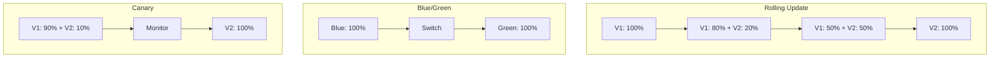
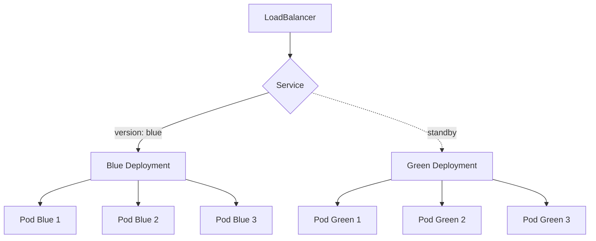
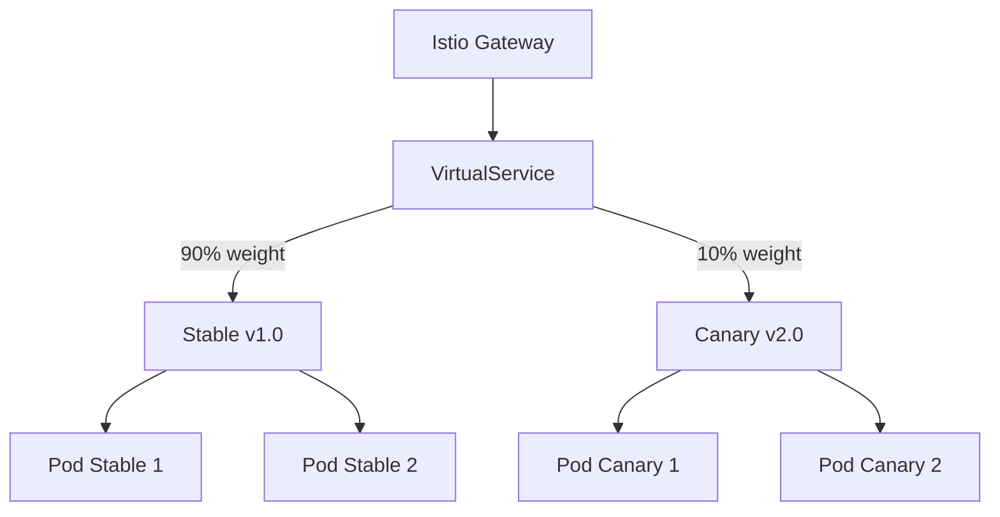
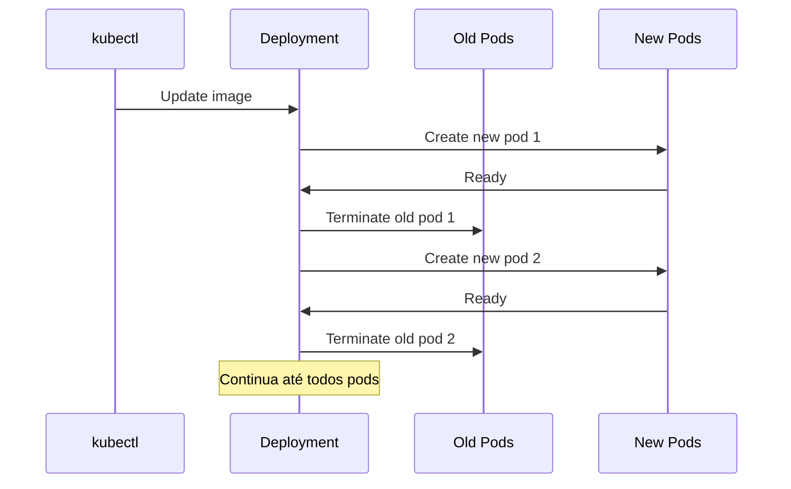
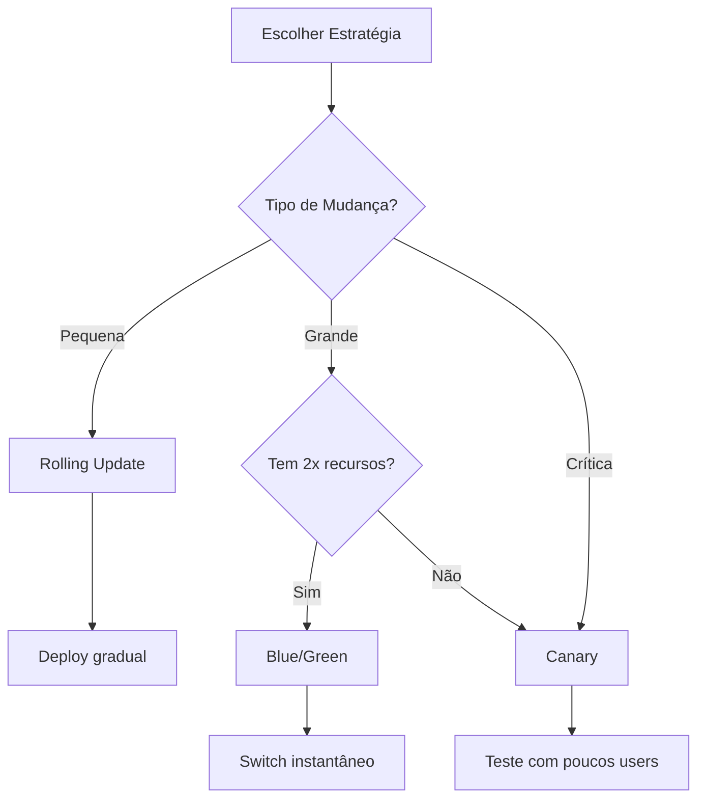

# 🎬 Vídeo 3.3 - Estratégias de Deploy Avançadas (Blue/Green e Canary)

**Aula**: 3 - Docker e Kubernetes  
**Vídeo**: 3.3  
**Temas**: Blue/Green; Canary; Rolling Update; Rollback  

---

## 📋 Pré-requisitos

**⚠️ Importante: Cluster EKS da Aula 01 ou Vídeo 3.2**

Este vídeo **reutiliza** o cluster EKS criado anteriormente. Não precisa criar um novo!

**Opções:**

1. **Cluster já existe e está ativo (Aula 01 ou Vídeo 3.2):**
   - ✅ Use o mesmo cluster: `cicd-lab`
   - ✅ Verifique se está conectado: `kubectl get nodes`
   - ✅ Continue com este vídeo

2. **Cluster foi deletado:**
   - 📚 Consulte os comandos da **Aula 01**
   - 📂 Repositório: [fiap-dclt-aula01](https://github.com/josenetoo/fiap-dclt-aula01)
   - 🔄 Ou siga o **Vídeo 3.2** (Parte 2: Criar Cluster EKS)
   - Recrie o cluster usando os mesmos comandos

3. **Primeira vez (não fez Aula 01 nem Vídeo 3.2):**
   - 📚 Vá para **Vídeo 3.2** primeiro
   - Crie o cluster EKS
   - Depois volte para este vídeo

**Verificar se cluster existe:**
```bash
# Ver clusters disponíveis
aws eks list-clusters --region us-east-1

# Testar conexão
kubectl get nodes

# Reconfigurar kubectl (se necessário)
aws eks update-kubeconfig \
  --name cicd-lab \
  --region us-east-1
```

**Pré-requisitos adicionais:**
- ✅ **kubectl configurado** e conectado ao cluster
- ✅ **Aplicação deployada** com Kustomize (Vídeo 3.2)
- ✅ **Service LoadBalancer** funcionando

---

## 📚 Parte 1: Estratégias de Deploy

### Passo 1: Comparação de Estratégias



**Características:**
- **Rolling Update**: Gradual, sem downtime, padrão K8s
- **Blue/Green**: Instantâneo, fácil rollback, requer 2x recursos
- **Canary**: Teste com poucos usuários, baixo risco

---

## ☸️ Parte 2: Criar Cluster EKS

### Passo 2: Verificar Pré-requisitos AWS

```bash
# Verificar AWS CLI
aws --version

# Verificar credenciais
aws sts get-caller-identity --profile fiapaws

# Verificar kubectl
kubectl version --client
```

### Passo 3: Configurar Variáveis e Discovery de Subnets

```bash
# Definir região (us-east-1 ou us-west-2)
export AWS_REGION=us-east-1
# ou
# export AWS_REGION=us-west-2

echo "Região selecionada: $AWS_REGION"

# Obter Account ID
export AWS_ACCOUNT_ID=$(aws sts get-caller-identity --profile fiapaws --query Account --output text)
echo "Account ID: $AWS_ACCOUNT_ID"

# Discovery de subnets públicas
echo "🔍 Descobrindo subnets públicas na região $AWS_REGION..."

aws ec2 describe-subnets \
  --profile fiapaws \
  --region $AWS_REGION \
  --filters "Name=map-public-ip-on-launch,Values=true" \
  --query 'Subnets[*].[SubnetId,AvailabilityZone,CidrBlock]' \
  --output table

# Obter IDs das subnets
export SUBNET_IDS=$(aws ec2 describe-subnets \
  --profile fiapaws \
  --region $AWS_REGION \
  --filters "Name=map-public-ip-on-launch,Values=true" \
  --query 'Subnets[*].SubnetId' \
  --output text)

echo "Subnets encontradas: $SUBNET_IDS"

# Validar
SUBNET_COUNT=$(echo $SUBNET_IDS | wc -w | tr -d ' ')
echo "Total de subnets públicas: $SUBNET_COUNT"

if [ $SUBNET_COUNT -lt 2 ]; then
  echo "❌ ERRO: EKS requer no mínimo 2 subnets. Encontradas: $SUBNET_COUNT"
  exit 1
else
  echo "✅ Subnets suficientes para criar cluster EKS"
fi
```

### Passo 4: Criar Cluster EKS

```bash
# Criar cluster EKS (AWS Learner Lab compatible)
echo "🚀 Criando cluster EKS na região $AWS_REGION..."

aws eks create-cluster \
  --name cicd-lab \
  --region $AWS_REGION \
  --role-arn arn:aws:iam::${AWS_ACCOUNT_ID}:role/LabRole \
  --resources-vpc-config subnetIds=$(echo $SUBNET_IDS | tr ' ' ',') \
  --profile fiapaws

# Aguardar cluster ativo (15-20 min)
echo "⏳ Aguardando cluster ficar ativo (15-20 minutos)..."
aws eks wait cluster-active \
  --name cicd-lab \
  --region $AWS_REGION \
  --profile fiapaws

echo "✅ Cluster ativo!"
```

### Passo 5: Criar Node Group

```bash
# Criar node group
echo "🚀 Criando node group..."

aws eks create-nodegroup \
  --cluster-name cicd-lab \
  --nodegroup-name workers \
  --node-role arn:aws:iam::${AWS_ACCOUNT_ID}:role/LabRole \
  --subnets $(echo $SUBNET_IDS | tr ' ' ',') \
  --instance-types t3.medium \
  --scaling-config minSize=2,maxSize=2,desiredSize=2 \
  --region $AWS_REGION \
  --profile fiapaws

# Aguardar node group ativo
echo "⏳ Aguardando node group ficar ativo..."
aws eks wait nodegroup-active \
  --cluster-name cicd-lab \
  --nodegroup-name workers \
  --region $AWS_REGION \
  --profile fiapaws

echo "✅ Node group ativo!"
```

### Passo 6: Configurar kubectl

```bash
# Configurar acesso ao cluster
aws eks update-kubeconfig \
  --name cicd-lab \
  --region $AWS_REGION \
  --profile fiapaws

# Verificar nodes
kubectl get nodes

# Ver informações detalhadas
kubectl get nodes -o wide
```

**⚠️ Importante - AWS Learner Lab:**
- Usar sempre `--profile fiapaws` nos comandos AWS CLI
- Instance types suportados: nano, micro, small, medium, large
- Máximo de 9 instâncias EC2 concorrentes
- Máximo de 32 vCPU concorrentes
- Regiões: us-east-1 ou us-west-2
- Role: LabRole (já existe no ambiente)

---

## 🔵🟢 Parte 3: Blue/Green Deploy

### Passo 6: Arquitetura Blue/Green



### Passo 7: Entender Manifests Blue/Green

**Os arquivos já estão criados no repositório em `k8s/blue-green/`**

Vamos entender o que cada um faz:

**Deployment Blue (`deployment-blue.yaml`):**
```yaml
apiVersion: apps/v1
kind: Deployment
metadata:
  name: fiap-todo-blue
  labels:
    app: fiap-todo-api
    version: blue
spec:
  replicas: 3
  selector:
    matchLabels:
      app: fiap-todo-api
      version: blue
  template:
    metadata:
      labels:
        app: fiap-todo-api
        version: blue
    spec:
      containers:
      - name: api
        image: YOUR_ECR_URI/fiap-todo-api:v1.0
        ports:
        - containerPort: 3000
        env:
        - name: VERSION
          value: "blue"
        resources:
          requests:
            memory: "128Mi"
            cpu: "100m"
          limits:
            memory: "256Mi"
            cpu: "200m"
```

**Pontos-chave:**
- Label `version: blue` identifica esta versão
- Imagem: `v1.0` (versão atual em produção)

**Deployment Green (`deployment-green.yaml`):**
```yaml
# Similar ao Blue, mas com:
# - name: fiap-todo-green
# - version: green
# - image: v2.0 (nova versão)
```

**Service (`service.yaml`):**
```yaml
apiVersion: v1
kind: Service
metadata:
  name: fiap-todo-api
spec:
  type: LoadBalancer
  selector:
    app: fiap-todo-api
    version: blue  # ⬅️ Aponta para blue inicialmente
  ports:
  - port: 80
    targetPort: 3000
```

**🔑 Conceito-chave**: O Service usa o selector `version` para rotear tráfego. Mudando apenas essa label, fazemos o switch instantâneo!

### Passo 8: Deploy Blue/Green

```bash
# Deploy blue (versão atual)
kubectl apply -f k8s/blue-green/deployment-blue.yaml
kubectl apply -f k8s/blue-green/service.yaml

# Aguardar blue estar pronto
kubectl rollout status deployment/fiap-todo-blue

# Testar blue
LB_URL=$(kubectl get service fiap-todo-api -o jsonpath='{.status.loadBalancer.ingress[0].hostname}')
curl http://$LB_URL/health

# Deploy green (nova versão)
kubectl apply -f k8s/blue-green/deployment-green.yaml

# Aguardar green estar pronto
kubectl rollout status deployment/fiap-todo-green

# Testar green diretamente (port-forward)
kubectl port-forward deployment/fiap-todo-green 8080:3000 &
curl http://localhost:8080/health
pkill -f "port-forward"
```

### Passo 9: Switch Blue → Green

```bash
# Verificar versão atual
CURRENT=$(kubectl get service fiap-todo-api -o jsonpath='{.spec.selector.version}')
echo "Current version: $CURRENT"

# Fazer o switch para green
kubectl patch service fiap-todo-api -p '{"spec":{"selector":{"version":"green"}}}'

echo "✅ Switched to green"
echo "Testing..."

sleep 5
LB_URL=$(kubectl get service fiap-todo-api -o jsonpath='{.status.loadBalancer.ingress[0].hostname}')
curl -f http://$LB_URL/health && echo "✅ Health check passed!"
```

### Passo 10: Rollback Blue/Green

```bash
# Se green tiver problema, voltar para blue
kubectl patch service fiap-todo-api -p '{"spec":{"selector":{"version":"blue"}}}'

echo "✅ Rollback to blue completed!"
# Instantâneo! Sem downtime!
```

---

## 🐤 Parte 4: Canary Deploy

### Passo 11: Arquitetura Canary com Istio



**Por que Istio?**
- ✅ Controle preciso de tráfego por peso (não depende de número de réplicas)
- ✅ Roteamento inteligente baseado em headers, cookies, etc
- ✅ Métricas e observabilidade integradas
- ✅ Rollback instantâneo
- ✅ Usado em produção por grandes empresas

### Passo 12: Entender Deployments e Services

**Os arquivos já estão criados em `k8s/canary-istio/`**

Vamos entender cada um:

**Deployment Stable (`deployment-stable.yaml`):**
```yaml
apiVersion: apps/v1
kind: Deployment
metadata:
  name: fiap-todo-stable
spec:
  replicas: 2
  selector:
    matchLabels:
      app: fiap-todo-api
      version: v1
  template:
    metadata:
      labels:
        app: fiap-todo-api
        version: v1
    spec:
      containers:
      - name: api
        image: YOUR_ECR_URI/fiap-todo-api:v1.0
        ports:
        - containerPort: 3000
        env:
        - name: VERSION
          value: "v1.0"
```

**Deployment Canary (`deployment-canary.yaml`):**
```yaml
apiVersion: apps/v1
kind: Deployment
metadata:
  name: fiap-todo-canary
spec:
  replicas: 2  # Mesmo número! Istio controla o tráfego
  selector:
    matchLabels:
      app: fiap-todo-api
      version: v2
  template:
    metadata:
      labels:
        app: fiap-todo-api
        version: v2
    spec:
      containers:
      - name: api
        image: YOUR_ECR_URI/fiap-todo-api:v2.0
        ports:
        - containerPort: 3000
        env:
        - name: VERSION
          value: "v2.0"
```

**Service (`service.yaml`):**
```yaml
apiVersion: v1
kind: Service
metadata:
  name: fiap-todo-api
spec:
  ports:
  - port: 80
    targetPort: 3000
  selector:
    app: fiap-todo-api  # Seleciona ambas versões
```

**🔑 Pontos importantes:**
- Ambos deployments têm **2 réplicas** (não importa o número!)
- Label `version: v1` e `version: v2` diferenciam as versões
- Service seleciona apenas `app: fiap-todo-api` (pega ambos)
- Estes são arquivos Kubernetes padrão - funcionam sem Istio!

### Passo 13: Instalar Istio

**Agora vamos adicionar o Istio por cima da infraestrutura:**

**Linux/Mac:**
```bash
# Download Istio
curl -L https://istio.io/downloadIstio | sh -
cd istio-*
export PATH=$PWD/bin:$PATH
```

**Windows (PowerShell):**
```powershell
# Download Istio
curl -L https://istio.io/downloadIstio | sh -
cd istio-*
$env:PATH += ";$PWD\bin"
```

**Ou baixar manualmente:**
- Acesse: https://github.com/istio/istio/releases
- Baixe a versão mais recente para seu OS
- Extraia e adicione `bin/` ao PATH

**Instalação (todos os sistemas):**
```bash
# Instalar Istio no cluster
istioctl install --set profile=demo -y

# Habilitar injeção automática de sidecar no namespace default
kubectl label namespace default istio-injection=enabled

# Verificar instalação
kubectl get pods -n istio-system

# Ver componentes instalados
kubectl get svc -n istio-system
```

**O que foi instalado:**
- ✅ `istiod`: Control plane (gerenciamento)
- ✅ `istio-ingressgateway`: Gateway de entrada
- ✅ `istio-egressgateway`: Gateway de saída (opcional)

### Passo 14: Entender Recursos Istio

**Os recursos Istio já estão em `k8s/canary-istio/virtualservice.yaml`**

Este é o arquivo-chave que controla o tráfego:

```yaml
apiVersion: networking.istio.io/v1beta1
kind: VirtualService
metadata:
  name: fiap-todo-api
spec:
  hosts:
  - fiap-todo-api
  http:
  - match:
    - headers:
        x-canary:
          exact: "true"  # Header para testar canary
    route:
    - destination:
        host: fiap-todo-api
        subset: v2
      weight: 100
  - route:  # Tráfego normal
    - destination:
        host: fiap-todo-api
        subset: v1
      weight: 90  # 90% para stable
    - destination:
        host: fiap-todo-api
        subset: v2
      weight: 10  # 10% para canary
---
apiVersion: networking.istio.io/v1beta1
kind: DestinationRule
metadata:
  name: fiap-todo-api
spec:
  host: fiap-todo-api
  subsets:
  - name: v1
    labels:
      version: v1
  - name: v2
    labels:
      version: v2
```

**🔑 Conceito-chave**: 
- **VirtualService**: Controla a % de tráfego por peso (não depende de réplicas!)
- **DestinationRule**: Define os subsets (v1 e v2) baseados em labels
- **Header routing**: `x-canary: true` permite testar canary diretamente
- **Weights**: 90% stable + 10% canary = controle preciso

### Passo 15: Deploy e Testar Canary

**Deploy (todos os sistemas):**
```bash
# Deploy de tudo
kubectl apply -f k8s/canary-istio/

# Aguardar pods
kubectl rollout status deployment/fiap-todo-stable
kubectl rollout status deployment/fiap-todo-canary

# Ver pods (ambos com sidecar Istio)
kubectl get pods -l app=fiap-todo-api
# Cada pod terá 2 containers: app + istio-proxy
```

**Obter URL do Gateway:**

**Linux/Mac:**
```bash
export INGRESS_HOST=$(kubectl -n istio-system get service istio-ingressgateway -o jsonpath='{.status.loadBalancer.ingress[0].hostname}')
export INGRESS_PORT=$(kubectl -n istio-system get service istio-ingressgateway -o jsonpath='{.spec.ports[?(@.name=="http2")].port}')
export GATEWAY_URL=$INGRESS_HOST:$INGRESS_PORT
echo "Gateway URL: $GATEWAY_URL"
```

**Windows (PowerShell):**
```powershell
$INGRESS_HOST = kubectl -n istio-system get service istio-ingressgateway -o jsonpath='{.status.loadBalancer.ingress[0].hostname}'
$INGRESS_PORT = kubectl -n istio-system get service istio-ingressgateway -o jsonpath='{.spec.ports[?(@.name==\"http2\")].port}'
$GATEWAY_URL = "$INGRESS_HOST:$INGRESS_PORT"
Write-Host "Gateway URL: $GATEWAY_URL"
```

**Testar distribuição de tráfego:**

**Linux/Mac:**
```bash
# 100 requisições
for i in {1..100}; do
  curl -s http://$GATEWAY_URL/health | jq -r '.version'
done | sort | uniq -c

# Resultado esperado:
# ~90 v1.0
# ~10 v2.0
```

**Windows (PowerShell):**
```powershell
# 100 requisições
1..100 | ForEach-Object {
  (curl -s "http://$GATEWAY_URL/health" | ConvertFrom-Json).version
} | Group-Object | Select-Object Name, Count

# Resultado esperado:
# v1.0: ~90
# v2.0: ~10
```

**Testar canary diretamente com header:**
```bash
# Linux/Mac/Windows (mesmo comando)
curl -H "x-canary: true" http://$GATEWAY_URL/health
# Sempre retorna v2.0
```

### Passo 16: Ajustar Peso do Canary

```bash
# Aumentar canary para 25%
kubectl patch virtualservice fiap-todo-api --type merge -p '
{
  "spec": {
    "http": [{
      "route": [
        {"destination": {"host": "fiap-todo-api", "subset": "v1"}, "weight": 75},
        {"destination": {"host": "fiap-todo-api", "subset": "v2"}, "weight": 25}
      ]
    }]
  }
}'

# Testar nova distribuição
for i in {1..100}; do
  curl -s http://$GATEWAY_URL/health | jq -r '.version'
done | sort | uniq -c
# Agora: ~75 v1.0, ~25 v2.0

# Aumentar para 50%
kubectl patch virtualservice fiap-todo-api --type merge -p '
{
  "spec": {
    "http": [{
      "route": [
        {"destination": {"host": "fiap-todo-api", "subset": "v1"}, "weight": 50},
        {"destination": {"host": "fiap-todo-api", "subset": "v2"}, "weight": 50}
      ]
    }]
  }
}'

# Promover para 100% (se tudo OK)
kubectl patch virtualservice fiap-todo-api --type merge -p '
{
  "spec": {
    "http": [{
      "route": [
        {"destination": {"host": "fiap-todo-api", "subset": "v2"}, "weight": 100}
      ]
    }]
  }
}'

echo "✅ Canary promovido para 100%!"
```

### Passo 17: Rollback Instantâneo

```bash
# Se detectar problema, voltar para v1 instantaneamente
kubectl patch virtualservice fiap-todo-api --type merge -p '
{
  "spec": {
    "http": [{
      "route": [
        {"destination": {"host": "fiap-todo-api", "subset": "v1"}, "weight": 100}
      ]
    }]
  }
}'

echo "✅ Rollback instantâneo para v1!"
# Sem restart de pods, sem downtime!
```

---

## 🔄 Parte 5: Rolling Update

### Passo 16: Fluxo Rolling Update



### Passo 17: Configurar Rolling Update

```yaml
# deployment.yaml
spec:
  replicas: 10
  strategy:
    type: RollingUpdate
    rollingUpdate:
      maxSurge: 2        # Máximo de pods extras durante update
      maxUnavailable: 1  # Máximo de pods indisponíveis
```

### Passo 18: Executar Rolling Update

```bash
# Update da imagem
kubectl set image deployment/fiap-todo-api \
  api=YOUR_ECR_URI/fiap-todo-api:v2.0

# Acompanhar rollout
kubectl rollout status deployment/fiap-todo-api

# Ver histórico
kubectl rollout history deployment/fiap-todo-api
```

### Passo 19: Rollback Rolling Update

```bash
# Rollback para versão anterior
kubectl rollout undo deployment/fiap-todo-api

# Rollback para revisão específica
kubectl rollout undo deployment/fiap-todo-api --to-revision=2

# Pausar rollout (se detectar problema)
kubectl rollout pause deployment/fiap-todo-api

# Retomar rollout
kubectl rollout resume deployment/fiap-todo-api
```

---

## 🚀 Parte 6: Pipeline com Estratégias

### Passo 20: Workflow Canary Deploy com Istio

**Workflow que criaremos durante a aula:**

```yaml
name: 🐤 Canary Deploy with Istio

on:
  workflow_dispatch:
    inputs:
      canary-percentage:
        description: 'Canary percentage (0-100)'
        required: true
        default: '10'
        type: choice
        options:
          - '10'
          - '25'
          - '50'
          - '100'
      action:
        description: 'Action'
        required: true
        default: 'deploy'
        type: choice
        options:
          - 'deploy'
          - 'rollback'

jobs:
  canary-deploy:
    name: 🐤 Canary with Istio
    runs-on: ubuntu-latest
    
    steps:
      - name: 📥 Checkout
        uses: actions/checkout@v4
      
      - name: 🔑 Configure AWS
        uses: aws-actions/configure-aws-credentials@v4
        with:
          aws-access-key-id: ${{ secrets.AWS_ACCESS_KEY_ID }}
          aws-secret-access-key: ${{ secrets.AWS_SECRET_ACCESS_KEY }}
          aws-session-token: ${{ secrets.AWS_SESSION_TOKEN }}
          aws-region: us-east-1
      
      - name: ☸️ Update kubeconfig
        run: |
          aws eks update-kubeconfig --name cicd-lab --region us-east-1
      
      - name: 🐤 Adjust Canary Traffic
        if: github.event.inputs.action == 'deploy'
        run: |
          CANARY_PCT=${{ github.event.inputs.canary-percentage }}
          STABLE_PCT=$((100 - CANARY_PCT))
          
          echo "🎯 Adjusting traffic: Stable $STABLE_PCT% | Canary $CANARY_PCT%"
          
          # Atualizar VirtualService com novo peso
          kubectl patch virtualservice fiap-todo-api --type merge -p "
          {
            \"spec\": {
              \"http\": [{
                \"route\": [
                  {\"destination\": {\"host\": \"fiap-todo-api\", \"subset\": \"v1\"}, \"weight\": $STABLE_PCT},
                  {\"destination\": {\"host\": \"fiap-todo-api\", \"subset\": \"v2\"}, \"weight\": $CANARY_PCT}
                ]
              }]
            }
          }"
          
          echo "✅ Traffic adjusted successfully!"
      
      - name: 🔙 Rollback to Stable
        if: github.event.inputs.action == 'rollback'
        run: |
          echo "🔙 Rolling back to 100% stable..."
          
          kubectl patch virtualservice fiap-todo-api --type merge -p '
          {
            "spec": {
              "http": [{
                "route": [
                  {"destination": {"host": "fiap-todo-api", "subset": "v1"}, "weight": 100}
                ]
              }]
            }
          }'
          
          echo "✅ Rollback completed - 100% on stable!"
      
      - name: 🧪 Monitor Canary
        if: github.event.inputs.action == 'deploy'
        run: |
          echo "📊 Monitoring canary deployment..."
          
          # Obter métricas do Istio
          kubectl get virtualservice fiap-todo-api -o yaml
          
          # Verificar pods
          kubectl get pods -l app=fiap-todo-api
          
          echo "✅ Canary is running. Monitor metrics in Kiali/Grafana"
      
      - name: 📊 Deployment Summary
        run: |
          echo "## 🐤 Canary Deployment with Istio" >> $GITHUB_STEP_SUMMARY
          echo "" >> $GITHUB_STEP_SUMMARY
          echo "**Action**: ${{ github.event.inputs.action }}" >> $GITHUB_STEP_SUMMARY
          
          if [ "${{ github.event.inputs.action }}" == "deploy" ]; then
            echo "**Canary Weight**: ${{ github.event.inputs.canary-percentage }}%" >> $GITHUB_STEP_SUMMARY
            echo "**Stable Weight**: $((100 - ${{ github.event.inputs.canary-percentage }}))%" >> $GITHUB_STEP_SUMMARY
          else
            echo "**Status**: Rolled back to 100% stable" >> $GITHUB_STEP_SUMMARY
          fi
          
          echo "" >> $GITHUB_STEP_SUMMARY
          echo "### Pods Status:" >> $GITHUB_STEP_SUMMARY
          echo '```' >> $GITHUB_STEP_SUMMARY
          kubectl get pods -l app=fiap-todo-api >> $GITHUB_STEP_SUMMARY
          echo '```' >> $GITHUB_STEP_SUMMARY
```

**Vantagens desta pipeline**:
- ✅ Ajuste de tráfego via Istio (não depende de réplicas)
- ✅ Opções pré-definidas (10%, 25%, 50%, 100%)
- ✅ Ação de rollback integrada
- ✅ Sem downtime ou restart de pods
- ✅ Monitoramento via Istio metrics

---

## 🎓 Parte 7: Conceitos Aprendidos

### Passo 21: Matriz de Decisão



**Estratégias de deploy:**
- ✅ **Rolling Update**: Gradual, padrão K8s, baixo risco
- ✅ **Blue/Green**: Switch instantâneo, fácil rollback, requer 2x recursos
- ✅ **Canary**: Teste com % pequeno, validação real, baixo risco

---

## 🧹 Parte 8: Limpeza

### Passo 22: Limpar Recursos

```bash
# Deletar deployments
kubectl delete deployment --all

# Deletar services
kubectl delete service fiap-todo-api

# Deletar cluster (se não for usar mais)
aws eks delete-nodegroup \
  --cluster-name cicd-lab \
  --nodegroup-name workers \
  --region us-east-1 \
  --profile fiapaws

aws eks delete-cluster \
  --name cicd-lab \
  --region us-east-1 \
  --profile fiapaws
```

---

**FIM DO VÍDEO 3.3** ✅

**FIM DA AULA 3** 🎓
